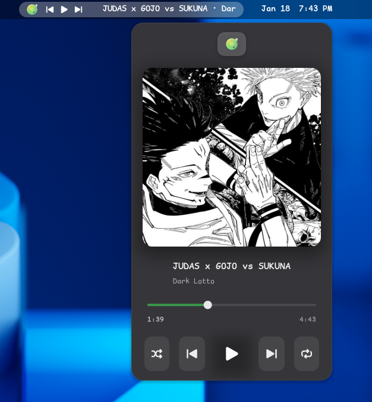
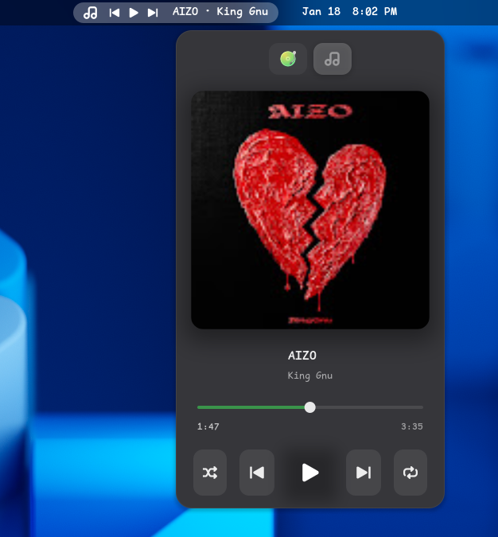
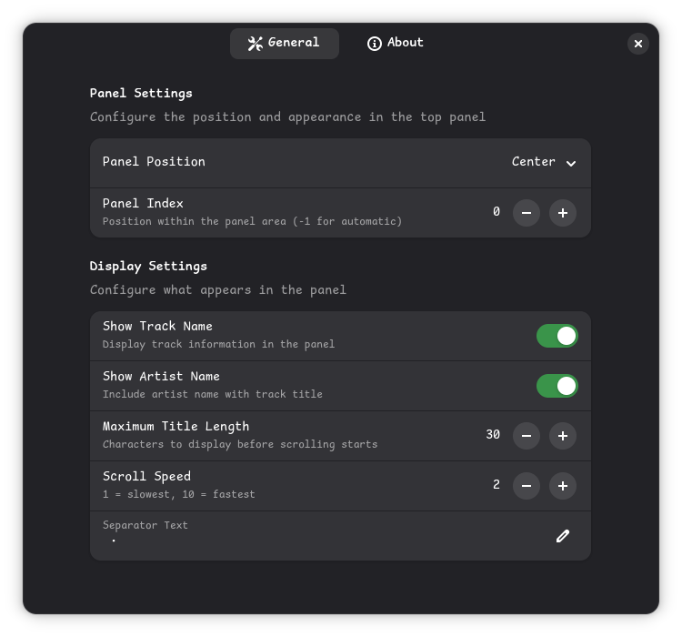

<div align="center">


# Advanced Media Controller  
### GNOME Shell Extension

*A beautiful, modern media controller for GNOME Shell. MPRIS-compatible player directly from your top panel.*

[](https://www.gnu.org/licenses/gpl-3.0)
[](https://gjs.guide/)
[](https://developer.mozilla.org/en-US/docs/Web/JavaScript)


</div>

---

## ✨ Features

### 🎨 Modern & Beautiful UI
- **Sleek album art display** - See your album covers in stunning detail
- **Smooth animations** - Buttery smooth transitions and interactions
- **Native GNOME design** - Perfectly integrated with your desktop theme
- **Dark mode friendly** - Looks gorgeous in both light and dark themes


*Beautiful media controls integrated seamlessly into GNOME Shell*

### 🎛️ Rich Media Controls
- ▶️ **Play/Pause** - Quick playback control
- ⏭️ **Next/Previous** - Skip through your tracks
- 🔀 **Shuffle** - Randomize your playlist
- 🔁 **Repeat** - Loop your favorite songs (None/Track/Playlist)
- 📊 **Progress slider** - Seek to any position in your track
- 🎵 **Track information** - Artist, title, and album display


*Quick controls right in your top panel*

### 🌐 Multi-Instance Browser Support
Works flawlessly with **multiple browser tabs** playing media simultaneously!
- 🦊 **Firefox** - Multiple tabs with different videos
- 🌐 **Chrome/Chromium** - Each tab appears as a separate player
- 🦁 **Brave** - Full multi-instance support
- 🔵 **Edge** - Seamlessly manages multiple media sources



*Switch between multiple media sources effortlessly*


### ⚙️ Highly Customizable

#### Panel Position & Layout
- Choose between **Left**, **Center**, or **Right** panel position
- Customize panel index (position within the area)
- Show/hide individual components


*Customize exactly how it appears in your panel*

#### Label Customization
- 📝 **Custom label format** - Arrange artist, title, album, track number
- 📏 **Adjustable length** - Fixed or dynamic title length
- 🌊 **Smooth scrolling** - For long track names
- ⚡ **Adjustable scroll speed** - Control animation speed
- ⏸️ **Scroll pause time** - Configure pause between scrolls


*Make it display exactly what you want*


### Available actions:
- Play/Pause/Stop
- Next/Previous track
- Volume up/down
- Toggle shuffle/repeat
- Show popup menu
- Raise/Quit player
- Open preferences

---

## 📦 Installation

### Method 1: GNOME Extensions Website (Recommended)
1. Visit [GNOME Extensions](https://extensions.gnome.org/) (coming soon)
2. Search for "Advanced Media Controller"
3. Click the toggle switch to install
4. Enjoy!

### Method 2: Manual Installation
```bash
# Clone the repository
git clone https://github.com/Sanjai-Shaarugesh/Advance-media-controller.git
cd Advanced-media-controller

# Copy to extensions directory
cp -r . ~/.local/share/gnome-shell/extensions/Advanced-media-controller/

# Restart GNOME Shell
# X11: Alt+F2, type 'r', press Enter
# Wayland: Log out and log back in

# Enable the extension
gnome-extensions enable Advanced-media-controller.com
```

### Method 3: From Release Package
```bash
# Download the latest release
wget https://github.com/Sanjai-Shaarugesh/advanced-media-controller/releases/latest/download/Advanced-media-controller.github.com.zip

# Install
gnome-extensions install Advanced-media-controller.github.com.zip

# Enable
gnome-extensions enable Advanced-media-controller.github.com
```

---

## 🎮 Usage

### Quick Start
1. Install the extension
2. Open any media player (Gapless, VLC, Firefox with YouTube, etc.)
3. The media controller appears automatically in your panel
4. Click to see full controls!

### Basic Controls
- **Click the play button** in the panel for quick play/pause
- **Click the extension** to open the full control popup
- **Use the slider** to seek through your track
- **Click player icons** to switch between multiple media sources


---

## 🎨 Screenshots

### Main Interface

*Clean, modern interface with album art*

### Panel Integration

*Perfectly integrated into GNOME's top panel*

### Multiple Players


*Easy switching between multiple media sources*

### Settings Panel

*Extensive customization options*

---

## 🔧 Supported Players

This extension works with **any MPRIS-compatible media player**:

---

## 🐛 Troubleshooting

### Extension doesn't appear
1. Make sure the extension is enabled: `gnome-extensions list`
2. Check if you have media playing
3. Restart GNOME Shell (Alt+F2, type 'r', Enter on X11)
4. Check system logs: `journalctl -f -o cat /usr/bin/gnome-shell`


---

## 🤝 Contributing

We love contributions! Whether it's:
- 🐛 Bug reports
- 💡 Feature requests
- 📝 Documentation improvements
- 🎨 UI/UX enhancements
- 🌍 Translations
- 💻 Code contributions

Please read our [CONTRIBUTING.md](CONTRIBUTING.md) guide to get started!

---

## 📜 License

This project is licensed under the **GPL-3.0 License** - see the [LICENSE](LICENSE) file for details.

---

## 💖 Support

If you find this extension useful, consider:

- ⭐ **Starring** the repository
- 🐛 **Reporting** bugs
- 💡 **Suggesting** features
- 🌍 **Translating** to your language
- ☕ **Buying me a coffee** - [buymeacoffee.com/sanjai](https://buymeacoffee.com/sanjai)

### Coffee Donations 
Scan the QR code or visit the link above to support development!


Your support helps maintain and improve this extension! 💙

---

## 🏆 Credits

### Data Sources
- **MPRIS D-Bus Interface** - Standard media player remote interfacing specification
- **GNOME Shell** - For the amazing desktop environment

### Built With
- JavaScript (GJS)
- GNOME Shell API
- D-Bus
- GTK4/Libadwaita (preferences)
- Love and coffee ☕

### Special Thanks
- The GNOME community
- All contributors and testers
- Everyone who reported bugs and suggested features

---

## 📮 Contact

- **Issues**: [GitHub Issues](https://github.com/Sanjai-Shaarugesh/Advance-media-controller.git/issues)
- **Discussions**: [GitHub Discussions](https://github.com/Sanjai-Shaarugesh/Advance-media-controller.git/discussions)
- **Email**: your.email@example.com

---

## 🗺️ Roadmap

### Planned Features
- [ ] 🌍 More translations
- [ ] 🎛️ Advanced EQ controls
- [ ] 🔊 Per-player volume control

---


## Donations

Support the development:

[](https://buymeacoffee.com/sanjai)

**Thank you for your support!**
# Please forgive me for my bad documentation 😅


**Star ⭐ my   repository if you find it useful!**
