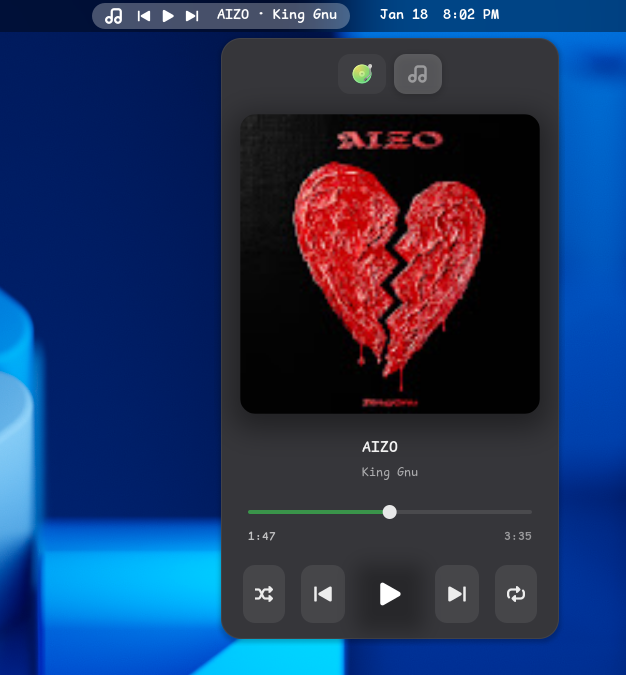
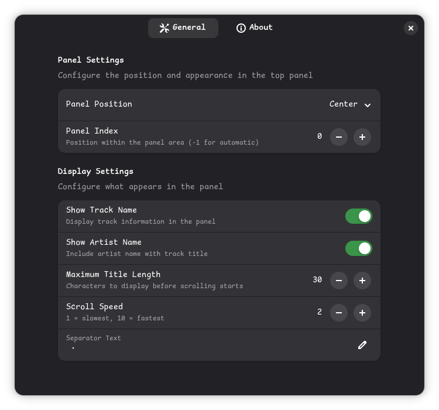
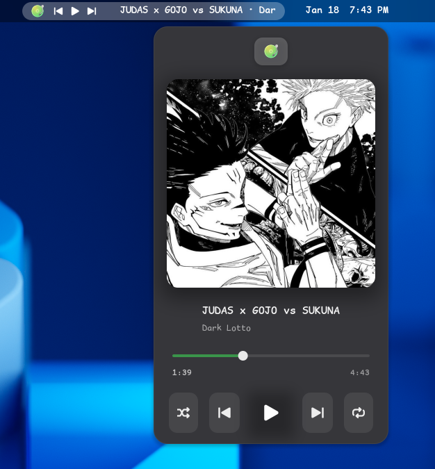

<div align="center">


# Advanced Media Controller

### GNOME Shell Extension

*A beautiful, modern media controller for GNOME Shell with MPRIS-compatible player integration*

[](https://www.gnu.org/licenses/gpl-3.0)
[](https://gjs.guide/)
[](https://developer.mozilla.org/en-US/docs/Web/JavaScript)

[Features](#-features) • [Installation](#-installation) • [Usage](#-usage) • [Screenshots](#-screenshots) • [Contributing](#-contributing)

</div>

---

> **Hey there, fellow Linux nerd** 👋 — tired of alt-tabbing to your media player just to skip a track? Yeah, same. I built this extension because the built-in GNOME media controls felt... underwhelming. This thing is what I actually wanted to use every day. Hope you love it too.

---

## ✨ Features

### 🎨 Modern & Beautiful UI

- **Sleek album art display** — Your album covers, crisp and gorgeous right in the shell
- **Smooth animations** — No janky transitions. Just buttery smooth everything
- **Native GNOME design** — Blends in like it was always there
- **Dark mode friendly** — Looks equally stunning in light and dark themes

<div align="center">


<br>
<em>Beautiful media controls integrated seamlessly into GNOME Shell</em>
</div>

### 🎛️ Rich Media Controls

- ▶️ **Play/Pause** — Quick playback control
- ⏭️ **Next/Previous** — Skip through your tracks
- 🔀 **Shuffle** — Randomize your playlist
- 🔁 **Repeat** — Loop your favorite songs (None / Track / Playlist)
- 📊 **Progress slider** — Seek to any position in your track
- 🎵 **Track information** — Artist, title, album — all right there

<div align="center">

<br>
<em>Quick controls right in your top panel</em>
</div>

### 🌐 Multi-Instance Browser Support

Got 12 YouTube tabs open? Relatable. This extension handles it like a pro.

- 🦊 **Firefox** — Multiple tabs with different videos, all tracked
- 🌐 **Chrome/Chromium** — Each tab as a separate player instance
- 🦁 **Brave** — Full multi-instance support
- 🔵 **Edge** — Seamlessly manages multiple media sources

<div align="center">

<br>

<br>
<em>Switch between multiple media sources effortlessly</em>
</div>

### 🌀 Rotating Album Art Cover

Your music should *feel* like it's spinning. So it does.


### 🔄 Rotating Album & Artist Name

Long track name? No worries — it scrolls and rotates so nothing gets cut off.


### 💿 Double-click for Vinyl Record Effect

Because sometimes you just want it to look *cool*. Double-click the album art to toggle the vinyl record animation on or off.


### 🎤 Time-Synced Lyrics

This one's a game changer. Triple-click the album art and boom — **scrolling, synced lyrics** appear.

- Lyrics are fetched automatically from **[lrclib.net](https://lrclib.net)** — free, no account, no BS
- The **active lyric line is highlighted and auto-centered** as the song progresses
- Single-click anywhere on the lyrics panel to go back to album art
- Each player tab **remembers its own lyrics preference independently**
- Huge shoutout to [@NarkAgni/spotify-controller](https://github.com/NarkAgni/spotify-controller) for the inspiration 🙏


### 💿 Per-App Instance Vinyl Style Effect

Fine-grained control over the vinyl effect, because one size doesn't fit all:

- Enable the **vinyl effect per application instance** — double-click the album art in the popup
- Prefer a global toggle? **Enable vinyl for all apps at once** from settings
- Want to exclude a specific app? **Disable vinyl per-app** directly from the preferences panel


### ⚙️ Highly Customizable

#### Panel Position & Layout

- Choose between **Left**, **Center**, or **Right** panel position
- Customize panel index (position within the area)
- Show/hide individual components

#### Label Customization

- 📝 **Custom label format** — Arrange artist, title, album, track number however you like
- 📏 **Adjustable length** — Fixed or dynamic title length
- 🌊 **Smooth scrolling** — For those extra-long track names
- ⚡ **Adjustable scroll speed** — You're in control
- ⏸️ **Scroll pause time** — Configure the pause between scrolls

<div align="center">

<br>
<em>Customize exactly how it appears in your panel</em>
</div>

### 🎮 Available Actions

- Play / Pause / Stop
- Next / Previous track
- Volume up / down
- Toggle shuffle / repeat
- Show popup menu
- Raise / Quit player
- Open preferences

---

## 🌍 Language Support

> The extension speaks your language — literally.

This extension is **fully internationalized (i18n)** and currently supports the following languages. The UI adapts automatically based on your system locale:

<div align="center">

<!-- Language support animation table -->

| 🌐 Language | Locale Code | Status |
|:-----------:|:-----------:|:------:|
| 🇩🇪 German | `de` | ✅ Available |
| 🇪🇸 Spanish | `es`, `es_ES`, `es@latin`, `es_ES.UTF-8` | ✅ Available |
| 🇫🇷 French | `fr` | ✅ Available |
| 🇯🇵 Japanese | `ja` | ✅ Available |
| 🇨🇳 Chinese (Simplified) | `zh_CN` | ✅ Available |
| 🇹🇼 Chinese (Traditional) | `zh_TW` | ✅ Available |
| 🇬🇧 English | `en` | ✅ Default |

</div>

```
po/
├── de/LC_MESSAGES/       # 🇩🇪 Deutsch
├── es/LC_MESSAGES/       # 🇪🇸 Español
├── es@latin/LC_MESSAGES/ # 🇪🇸 Español (Latin)
├── es_ES/LC_MESSAGES/    # 🇪🇸 Español (España)
├── es_ES.UTF-8/          # 🇪🇸 Español (España UTF-8)
├── es_ES.utf8/           # 🇪🇸 Español (España utf8)
├── fr/LC_MESSAGES/       # 🇫🇷 Français
├── ja/LC_MESSAGES/       # 🇯🇵 日本語
├── zh_CN/LC_MESSAGES/    # 🇨🇳 中文 (简体)
└── zh_TW/LC_MESSAGES/    # 🇹🇼 中文 (繁體)
```

**Want to add your language?** It's easier than you think — check out the [Contributing](#-contributing) section. Translations are always welcome! 🙌

---

## 🐛 Bug Fixes

Because polish matters. Recent fixes include:

- **Fixed caching issues** with the progress slider and timing labels per app instance — no more weird desync
- **Time labels and progress bar now retain their position correctly** using improved per-instance caching
- **Scrolling state is now preserved** — no more unexpected jumps mid-track
- General stability improvements across multiple simultaneous player sessions

---

## 📦 Installation

### Method 1: GNOME Extensions Website *(Recommended)*

1. Visit [GNOME Extensions](https://extensions.gnome.org/)
2. Search for **"Advanced Media Controller"**
3. Hit the toggle switch to install
4. That's it. You're done. Go enjoy your music 🎶

### Method 2: Manual Installation

```bash
# Clone the repo
git clone https://github.com/Sanjai-Shaarugesh/Advanced-media-controller.git
cd Advanced-media-controller

# Drop it into your extensions directory
cp -r . ~/.local/share/gnome-shell/extensions/Advanced-media-controller/

# Restart GNOME Shell
# X11: Alt+F2 → type 'r' → Enter
# Wayland: Log out and back in (I know, I know...)

# Enable the extension
gnome-extensions enable advanced-media-controller@sanjai.com
```

### Method 3: From Release Package

```bash
# Grab the latest release
wget https://github.com/Sanjai-Shaarugesh/advanced-media-controller/releases/latest/download/Advanced-media-controller.github.com.zip

# Install it
gnome-extensions install Advanced-media-controller.github.com.zip

# Enable it
gnome-extensions enable Advanced-media-controller.github.com
```

---

## 🎮 Usage

### Quick Start

1. Install the extension
2. Open any media player (Rhythmbox, VLC, Firefox + YouTube, Spotify, whatever)
3. The controller shows up automatically in your panel
4. Click it. Explore. Enjoy.

### Controls Cheatsheet

| Action | How |
|--------|-----|
| Play/Pause | Click the ▶️ button in panel |
| Full controls | Click the extension popup |
| Seek | Use the progress slider |
| Switch players | Click the player icons |
| **Lyrics** | Triple-click album art |
| **Vinyl effect** | Double-click album art |
| **Back to art** | Single-click lyrics panel |

---

## 🎨 Screenshots

<div align="center">

### Main Interface

<br>
<em>Clean, modern interface with album art</em>

### Panel Integration

<br>
<em>Perfectly integrated into GNOME's top panel</em>

### Multiple Players

<br>

<br>
<em>Easy switching between multiple media sources</em>

### Settings Panel

<br>
<em>Extensive customization options</em>

</div>

---

## 🔧 Supported Players

Works with **any MPRIS-compatible player** — if it plays media on Linux, this extension probably handles it:

- 🎵 Rhythmbox
- 🎬 VLC
- 🎧 Spotify
- 🌐 Web browsers (Firefox, Chrome, Brave, Edge)
- 🎼 Lollypop
- 📻 Gapless
- And practically anything else that uses MPRIS

---

## 🐛 Troubleshooting

### Extension doesn't appear

1. Make sure it's enabled: `gnome-extensions list`
2. Check if you actually have media playing (yes, really)
3. Restart GNOME Shell — X11: `Alt+F2` → `r` → Enter
4. Dig into the logs: `journalctl -f -o cat /usr/bin/gnome-shell`

### Controls not responding

- Your player needs to support MPRIS (most modern ones do)
- Try restarting the media player
- Check extension settings for conflicts

---

## 🤝 Contributing

Contributions make open source go round. Here's what's appreciated:

- 🐛 **Bug reports** — Found something broken? Tell me
- 💡 **Feature requests** — Got a wild idea? Open a discussion
- 📝 **Docs** — Spelling, clarity, anything helps
- 🎨 **UI/UX** — If you've got design chops, go wild
- 🌍 **Translations** — Add your language to the `po/` folder
- 💻 **Code** — PRs are always welcome

Check out [CONTRIBUTING.md](CONTRIBUTING.md) to get started!

---

## 📜 License

Licensed under **GPL-3.0** — see [LICENSE](LICENSE) for the legal stuff.

---

## 💖 Support

If this extension made your GNOME setup just a little bit better:

- ⭐ **Star** the repo — it genuinely helps
- 🐛 **Report** bugs you find
- 💡 **Suggest** features you want
- 🌍 **Translate** to your language
- ☕ **Buy me a coffee** if you're feeling generous

<div align="center">

### ☕ Support Development

<a href="https://buymeacoffee.com/sanjai">

</a>

<br><br>

<a href="https://buymeacoffee.com/sanjai">

</a>

<br>

*Your support keeps this thing maintained and growing* 💙

</div>

---

## 🏆 Credits

### Built With

- JavaScript (GJS) — the glue holding it all together
- GNOME Shell API
- D-Bus
- GTK4 / Libadwaita (for preferences)
- Way too much coffee ☕

### Inspired By

- [NarkAgni/spotify-controller](https://github.com/NarkAgni/spotify-controller) — lyrics feature inspiration
- The GNOME community for building such an extensible platform

<div align="center">

<a href="https://extensions.gnome.org/extension/9184/advanced-media-controller/">

</a>

</div>

### Special Thanks

- The GNOME community
- All contributors and testers
- Everyone who opened an issue, suggested a feature, or just left a kind comment

---

## 📮 Contact

- **Issues**: [GitHub Issues](https://github.com/Sanjai-Shaarugesh/Advanced-media-controller/issues)
- **Discussions**: [GitHub Discussions](https://github.com/Sanjai-Shaarugesh/Advanced-media-controller/discussions)

---

## 🗺️ Roadmap

### Planned Features

- [ ] 🌍 More language translations
- [ ] 🎛️ Advanced EQ controls
- [ ] 🔊 Per-player volume control
- [ ] 📊 Playback statistics
- [ ] 🎨 Custom themes
- [ ] ⌨️ Keyboard shortcuts

---

<div align="center">

## ⭐ Star History

**If this made your desktop life better, a star means a lot — thanks!** ⭐

---

Made with ❤️ and too much late-night caffeine by [Sanjai Shaarugesh](https://github.com/Sanjai-Shaarugesh)

</div>
